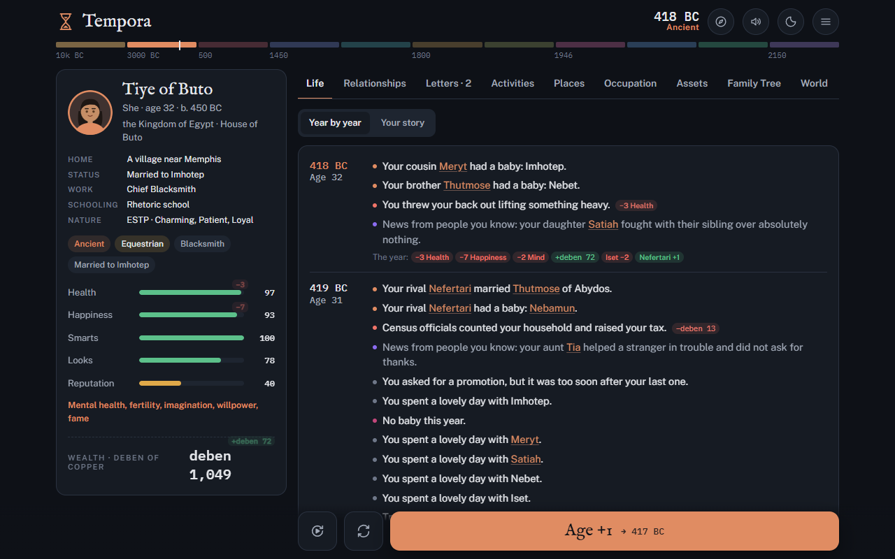
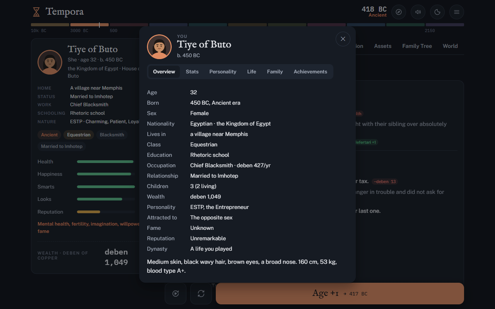
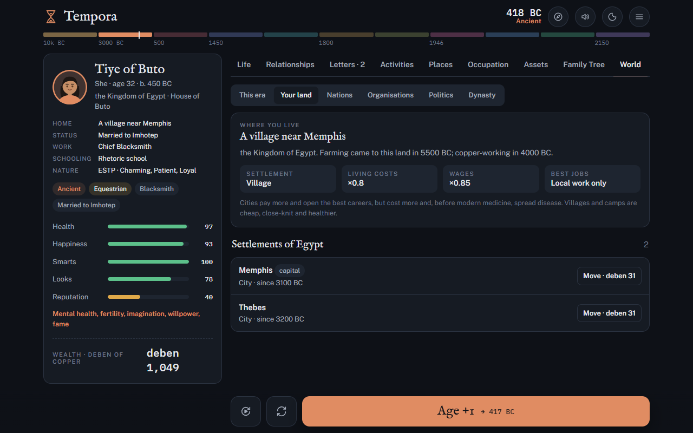
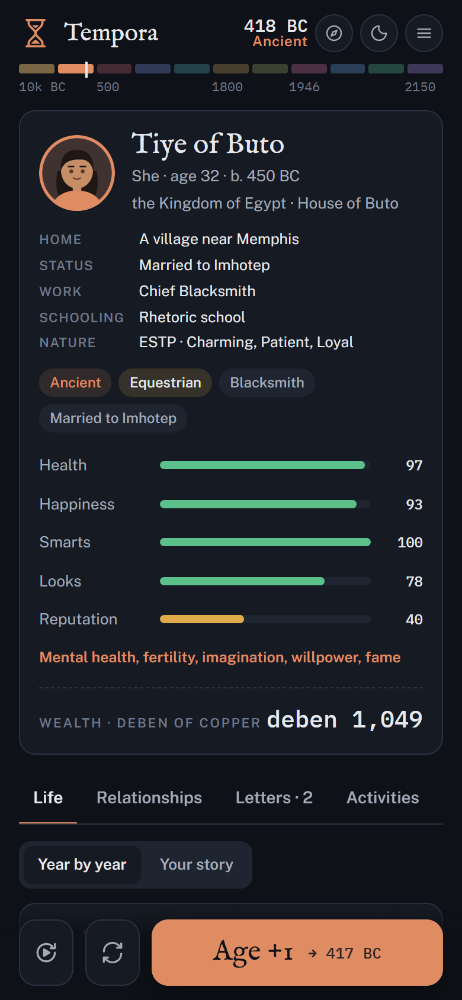

# Tempora

**A life simulator spanning twelve thousand years.**

[](https://github.com/Mofferato/tempora/actions/workflows/pages.yml)
[](LICENSE)

### [▶ Play Tempora in your browser](https://mofferato.github.io/tempora/)

Be born anywhere from 10,000 BC to the far future, from a Natufian hunting camp to ancient Thebes to a colony in the asteroid belt. You live one year at a time and can carry on through your children, relatives or anyone you knew.

The world keeps simulating everyone, including people you are not watching. Countries rise and fall, settlements grow into cities, migrations move people and genes, and rulers make and break wars.

The game is free and open source, with no ads, no accounts required and no install. It is a single HTML file that also works offline.



## Features

- **Eleven eras across 22 lands.** They run from Prehistory (Mesolithic Europe, the Natufians, the Iberomaurusians) through Ancient Egypt, medieval Europe, the World Wars and the digital age to the far future. Every era has its own careers, currency, laws, diseases and events.
- **A living world.** Everyone you know lives out their own life. Settlements grow, get renamed and are abandoned. Farming and copper spread across the world on historical dates. Migrations shift ancestry. Governments fall to revolutions, and rulers declare wars.
- **Deep characters.**
  - Genetics you inherit.
  - An MBTI type and personality traits that shape your odds, relationships and choices.
  - Social class that you can rise or fall in.
  - Fame, reputation, pets and a family crest.
- **Every part of life.**
  - School, careers and promotions.
  - Love, marriage and children.
  - Places to visit: tavern, church, hospital, market, battlefield and palace.
  - Courts and trials, wills and inheritance disputes, heirlooms.
  - Sports careers and the Olympics.
  - Politics: run for office, rule a nation, declare war.
- **Communication through time.** Letters become telegrams, then phones, then social media with followers and posts, then neural chat.
- **Feedback everywhere.** Every action, event and choice shows exactly how your stats changed. Buttons preview their effects before you commit.
- **Play hands-off if you like.**
  - Repeat last year's actions, or pin actions to run every year.
  - Autoplay toward a goal.
  - A built-in Guide that suggests your best moves.
- **Optional Claude integration.** You can chat with any character, ask for advice, have Claude play a year for you, or read your life back as a story.
- **Dynasties.** When you die, you continue as an heir, a relative or anyone you knew. Your family tree and dynasty traits build up over generations.
- **Three modes:** Narrative, Household (plan your whole family's year) and God mode (edit anything).
- **Music and sound.** Each era has its own procedural soundtrack.

<table>
  <tr>
    <td></td>
    <td></td>
  </tr>
  <tr>
    <td align="center">Click anyone to see their full profile</td>
    <td align="center">Settlements shape your costs, wages and careers</td>
  </tr>
</table>

<p align="center"></p>

## Playing

- **In your browser:** go to **[mofferato.github.io/tempora](https://mofferato.github.io/tempora/)**. Your game autosaves in that browser.
- **Offline:** download [`index.html`](https://raw.githubusercontent.com/Mofferato/tempora/main/index.html) and open it. Fonts load from Google Fonts when you're online and fall back to system fonts offline.
- **With accounts and cloud saves:** run the [Tempora platform](#tempora-platform) server. It adds accounts, saves that follow you across devices and a shared community.

On the website, the Community tab uses local profiles kept in your browser. Claude features need your own API key, entered under **Guide → Settings**, or a platform server.

## Building

The game is written as separate modules in `src/` and bundled into one file:

```bash
node build.js
```

The build writes two files:

- `index.html`: a full HTML document.
- `dist/tempora-artifact.html`: the same game without the `<html>`/`<head>` wrapper, for hosted publishing.

The module order is `JS_ORDER` in `build.js`. `npm run build` does the same thing. The game has no dependencies, so there is nothing to install first.

The website is deployed automatically. Every push to `main` is built, tested and published to GitHub Pages by [`.github/workflows/pages.yml`](.github/workflows/pages.yml).

## Testing

`tools/sim.js` runs the bundled game headlessly in a Node `vm` with a stub DOM. It plays many lives across every era, presses every tab and action, and reports runtime errors and balance statistics. The statistics include age at death by era, class at 40, fame, net worth, schooling gaps, world size, causes of death and MBTI spread.

```bash
node tools/sim.js 30 all --years 200 --quiet
```

`npm test` rebuilds the game and runs a shorter version of this in both modes, the same as CI does. The first argument is the number of lives and the second is an era id or `all`. Add `--typical` to play like an ordinary player rather than pressing every button. That mode is the one to use for balance numbers. Set `TEMPORA_DIAG=1` for extra diagnostics.

## Eras and lands

There are eleven eras, from **Prehistory** (10,000 to 3,001 BC) to the far future. There are 22 lands. Six of them start in prehistory: the Levant (Natufian), Mesopotamia, Anatolia, the Maghreb (Iberomaurusian), Scandinavia (Maglemosian, Mesolithic Europe) and the Andes. The other lands are extended back to 10,000 BC with hunter-gatherer cultures.

- **Settlements.** Each land has dated settlements at eight levels, from camp to megacity. Settlements grow, get renamed (for example Lutetia becomes Paris) and are abandoned.
- **Your home town matters.** It affects costs, pay, disease and which jobs and schools are open to you.
- **Farming, herding and copper** reach each land on historical dates (`DATA.neolithic`).
- **Migration waves** move people and genes between lands. You can also emigrate or move town yourself.

## Layout

| File | Role |
| --- | --- |
| `src/data-core.js` | Utilities (`U`), name pools, the `DATA` registry, the `J` / `A` / `D` table helpers and the `LATE` queue |
| `src/data-prehistory.js` | The Prehistory era |
| `src/data-eras1-4.js` | The historical and future eras: careers, currency, activities, diseases, laws, events, assets, causes of death |
| `src/data-world.js` | Dated world history, universal life events, universal activities, achievements |
| `src/data-stats.js` | The stats with tiered descriptions, life ambitions, activity labels |
| `src/data-countries.js`, `src/data-countries2.js` | Lands: names over time, governments, capitals, currencies, populations, genetics, class ladders, laws, name pools, national history, events, jobs, holidays |
| `src/data-regions.js` | Prehistoric lands and cultures, ancestral gene pools, settlements, migrations, regional name pools and events |
| `src/data-extra.js`, `src/data-life.js` | Pets, organisations, clubs, extra life events, events for other people's lives |
| `src/engine.js` | World state, people, family graph, mortality, NPC lives, history, the hook system (`Sim.addHook`) and change tracking (`Sim.snap` / `Sim.diff`) |
| `src/engine-player.js` | The player's year, careers and promotion, school, relationships, assets, death and inheritance, saves |
| `src/genetics.js` | Genomes, inheritance, phenotype, hereditary conditions, ancestry drift and microevolution |
| `src/engine-world.js` | Countries, currencies, laws, social class movement, fame, pets, nations, travel, organisations, ambitions, chapters |
| `src/personality.js` | MBTI types and 30 personality traits that affect odds, relationships, careers, health and choices |
| `src/settlements.js` | Settlement levels, towns, moving house, migration waves |
| `src/society.js` | Courts and trials, sentences, lawsuits, jury duty, news from people you know |
| `src/politics.js` | Governments, rulers and succession, revolutions, elections and office ladders, ruling decisions, declaring and ending wars |
| `src/delta.js` | Stat-change chips on every action, event, choice and year, plus previews on buttons |
| `src/places.js`, `src/places2.js` | Places you can visit: tavern, church, hospital, market, battlefield, palace and more |
| `src/auto.js` | Repeat last year, pinned actions, and autoplay with a goal and a choice policy |
| `src/profile.js` | The ID card on the character panel and the full profile of any person |
| `src/phone.js` | Letters, then telegrams, phones, social media and neural chat; inbox, contacts, posts and followers |
| `src/sports.js` | Sports careers: training, competitions, trials, going pro, the Olympics |
| `src/legacy.js` | Heirlooms, wills, inheritance law and disputes, dynasty traits, family crest |
| `src/ai.js` | The built-in advisor and autopilot, and Claude features (chat with anyone, advice, play-for-me, story prose) |
| `src/sound.js` | Procedural music for each era and sound effects |
| `src/household.js`, `src/fusion.js`, `src/community.js`, `src/tree.js` | Household mode, life fusion, the community, the family tree |
| `src/platform.js` | Client for the Tempora platform server: accounts, cloud saves, server-backed community and AI |
| `src/ui.js` … `src/ui4.js` | Rendering and click handlers for tabs and dialogs |
| `src/late.js`, `src/main.js` | Late UI registration, boot, the Age button, autosave |
| `src/style.css`, `src/style2.css`, `src/shell.html` | Styles and page skeleton |
| `server/server.js` | The Tempora platform server |
| `tools/sim.js` | Headless test harness |

The engine never touches the DOM. The UI reads `Sim.W`, the saveable world, and calls `Sim.*` actions.

New systems plug into the engine through hooks:

- **Registering a hook.** Use `Sim.addHook(name, fn, mode)`. The mode says how results combine: `seq` runs each function in turn, `mul` multiplies the results, `add` sums them and `cat` concatenates them.
- **Available hooks.** They cover mortality, fertility, pay, costs, odds, relationship change, yearly steps and more.

UI extensions use a different mechanism:

- **Registration.** Modules push functions onto the `LATE` queue.
- **Extension points.** The UI arrays they can extend include `ui.around`, `ui.beforeAge`, `ui.onAged`, `ui.worldExtra` and `ui.promptExtra`.

## Game modes

- **Narrative**: adds chapters at life milestones and more choice popups. A Story view reads your life back as prose.
- **Household**: adds a Household tab where you plan every family member's year, share meals and holidays, and hire help.
- **God**: makes everything editable, including stats, money, class, country, title, appearance, life and death, new people, time and history.
  - God tools are off by default in the other two modes. You can switch them on from the menu.
  - Features from the other modes stay available in God mode.

## Playing hands-off

- The **repeat button** next to Age repeats last year's actions.
- **Pins** on activities, interactions and places choose actions to run every year.
- The **auto-play button** next to Age (also **Menu → Auto-play**) plays for you:
  - It can play for a set number of years.
  - It follows a goal: wealth, fame, family, long life, scholar or power.
  - A choice policy handles event popups: safe, bold, in character, smart or random.
- The **Guide** (the compass in the header) gives ranked advice with one-tap actions. When Claude is connected, the Guide can also play a year for you, answer questions and suggest choices.

## Claude

The Claude features are chatting with anyone in the game, asking the Guide, "Play for me" and story prose. They pick the first backend that is available:

1. **Hosted page.** When the game runs as a hosted artifact, it uses the page's own Claude access and needs no key.
2. **Platform server.** The server holds the API key, and each signed-in user has a daily limit.
3. **Your own key.** Enter it under **Guide → Settings**. The browser calls the API directly with the official SDK. The key is kept in this browser's storage only.

The default model is `claude-opus-5`, with server-side fallbacks enabled. Everything else in the game works without Claude: the advisor, autopilot and choice hints are built in.

## Tempora platform

`server/server.js` is a small Node server with no framework. It serves the game and adds:

- **Accounts.** Passwords are hashed with scrypt. Sessions use HttpOnly cookies.
- **Cloud saves.** Each user gets an autosave plus five slots, which sync across devices.
- **A shared community.** Profiles, posts, likes, comments and follows update live through server-sent events.
- **A Claude proxy.** Each user has a daily limit.

To start it:

```bash
cd server
npm install
node server.js --port=8080 --data=./data
```

`npm install` is only needed for the Claude proxy; the rest runs on plain Node 18+.

Environment variables:

| Variable | Default | Meaning |
| --- | --- | --- |
| `PORT` / `HOST` | `8080` / `0.0.0.0` | Where to listen (`--port` overrides) |
| `TEMPORA_DATA` | `server/data` | Where accounts, saves and community data are stored (`--data` overrides) |
| `ANTHROPIC_API_KEY` | none | Enables the Claude proxy |
| `TEMPORA_AI_MODEL` | `claude-opus-5` | Model for the proxy |
| `TEMPORA_AI_DAILY` | `200` | Claude requests per user per day |
| `TEMPORA_SECURE_COOKIES` | off | Set to `1` when served over HTTPS |
| `TEMPORA_TRUST_PROXY` | off | Set to `1` only behind a reverse proxy that sets `X-Forwarded-For` |

For a public deployment, put the server behind HTTPS, for example with a reverse proxy, and set `TEMPORA_SECURE_COOKIES=1` and `TEMPORA_TRUST_PROXY=1`. Back up the data directory.

## Community

The Community tab changes with how the game is served:

- **Platform server.** It uses your Tempora account.
- **Hosted page with the shared database.** Everyone the page is shared with signs in with their Claude identity.
- **Standalone file.** It runs on local profiles kept in this browser.

## Adding content

Everything is plain data. Money in era tables is written in that era's own currency; `cur.r` converts it to the internal value unit so wealth carries across eras.

**A new era:** push an object to `DATA.eras`. Copy an existing era as the template, and keep eras contiguous and in order. The object needs these fields:

- `id`, `name`, and `from`/`to` years.
- `pal`: the light and dark accent colours.
- `cur`: the currency.
- `life`: modal adult age, child mortality, medicine, accident rate, fertility, ageing speed, tax and retirement age.
- `cost`, `names`, `edu`, `laws`.
- `L`: era labels for everyday activities.
- `jobs`, `acts`, `dis`, `ev`, `assets` and `die`.

**A career:** `J('Title', payPerYear, { sm, edu, rep, lk, risk, fame, vol, from, to, sex, grant, tf, neo })`. `tf` is a feminine title variant, `grant` an honorific the job confers, `neo` the farming stage a prehistoric job needs.

**A random life event:**

```js
{ id: 'duel', p: 0.04, min: 16, max: 60, from: 1450, to: 1650,
  t: 'A nobleman challenges you to a duel.',
  ch: [
    { l: 'Accept', odds: 0.55, win: { fx: { rep: 10 }, t: 'You won.' }, alt: { fx: { h: -30 }, t: 'You lost.' } },
    { l: 'Apologise', fx: { rep: -6 }, t: 'You swallowed your pride.' },
  ] }
```

Effect keys (`fx`):

- `h` health, `hp` happiness, `sm` smarts, `lk` looks, `rep` reputation.
- `$` money in era currency, `$c` money as a share of a year's living cost.
- `edu`, `jail`, `fire`, `job`, `lover`.

Any value may be a `[min, max]` range. Add the event to an era's `ev` list, or to `DATA.events` for every era.

**A historical event:** add `H(year, type, text, options)` to `DATA.history`.

- Types with effects: `plague`, `war`, `famine`, `crash`, `disaster`, `medicine`, `revolution`, `migration`.
- News-only types: `tech`, `culture`, `politics`, `law`.

The comment at the top of `data-world.js` describes each type's options.

**A settlement:** add `['Name', founded, abandoned (0 for never), 'year:level year:level …']` to a land in `DATA.cities` (`data-regions.js`). Write the name as `'Old>year>New'` to rename it in that year.

## Saves

Tempora autosaves in browser storage every year and has three manual slots. Browser storage can be cleared, so use **Menu → Export save** to keep a dynasty as a JSON file and **Import save** to restore it. On the platform server, signed-in players also get cloud slots under **Menu → Account**.

## Contributing

Contributions are welcome: bug fixes, new lands and cultures, events, balance changes and interface work. See [CONTRIBUTING.md](CONTRIBUTING.md) for setup, how the code fits together and the pull request checklist. Please follow the [code of conduct](CODE_OF_CONDUCT.md), and report security problems privately as described in [SECURITY.md](SECURITY.md).

## License

Tempora is released under the [MIT License](LICENSE). You're free to play it, host it, modify it and build on it.

Historical names, places and events are drawn from the historical record. Prehistoric personal names are modern reconstructions.
